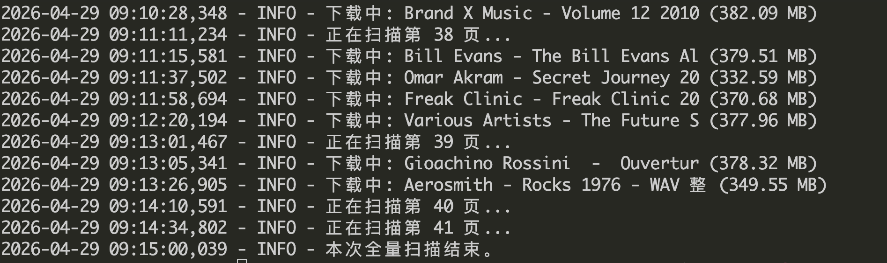

# OpenCD Subsidy Hunter

OpenCD Subsidy Hunter is a lightweight Python automation tool designed for **OpenCD** users. Its primary goal is to help users maximize their "Subsidy" using the **least amount of disk space** by automatically downloading specific free-leech torrents from the "Seeder Needed" list.

## 🌟 Key Features

- **Storage Minimized**: Specifically filters for torrents between **300MB and 400MB** to ensure high bonus efficiency with minimal storage impact.
- **Urgent Seeding Focus**: Automatically scrapes the **"Seeder Needed" (seeders=6)** list to ensure a high yield of **Bonus Points per hour**.
- **Filtering**: Only downloads torrents with the `Free` tag.
- **No Duplication**: Built-in SQLite database to prevent re-downloading the same torrent.
- **Safety**: Implements a **20-second interval** between torrent downloads to mimic human behavior and avoid account risks.

## 🛠️ Requirements

- Python 3.8+
- Dependencies: `requests`, `beautifulsoup4`, `schedule`

## 🚀 Quick Start

1. **Clone the repository:**
   ```bash
   git clone https://github.com/PerkeoLau/OpenCD-Subsidy-Hunter.git
   cd opencd-subsidy-hunter
2. **Install dependencies：**
   ```bash
   pip install -r requirements.txt
3. **Configure your Session:**
   Open the script file and locate the COOKIE_STRING variable. Replace the placeholder text with your actual cookie string obtained from your browser's Developer Tools (F12 > Network > Headers).
4. **Run the script:**
   ```bash
   python pt_downloader.py

## Preview
